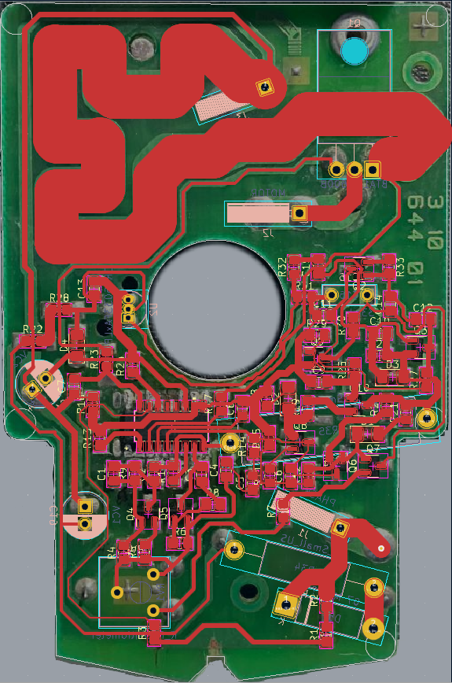

# stihl-viking-fse-81-te-1000
## About
STIHL stabilizer board for Viking TE-1000, FSE-81
In this repository, as an exercise, we present the reverse of the notorious stabilizer board for the Viking (Stihl) FSE-81 trimmer.

Плата стабилизатора STIHL для Viking TE-1000, FSE-81
В данном репозитории в качесте упражнения представлен реверс небезысвестной платы стабилизатора для тримера Viking (Stihl) FSE-81.
Данный реверс не для коммерческого пользования, является "учебным" проектом для домашнего пользования.
Все претензии направлять в Issue.

## Versions

### Version 0.3 (In-Progress)

TODO: Добавить номиналы резисторов, конденсаторов, обозначить стабилитроны (диоды Зенера) в соответствии с маркировкой, которая стерлась.

TODO: Заменить footprint для ряда компонентов

TODO: Изменить размеры платы + добавить Edge Cuts для производства.

### Version 0.2 (Release)

Изменена схема, добавлено согласование ширины дорожек

### Version 0.1 

Снята схема стабилизатора. Первичный макет.

## Stack

KiCad + Krita

## Picture

### Reference:

### Scheme:

